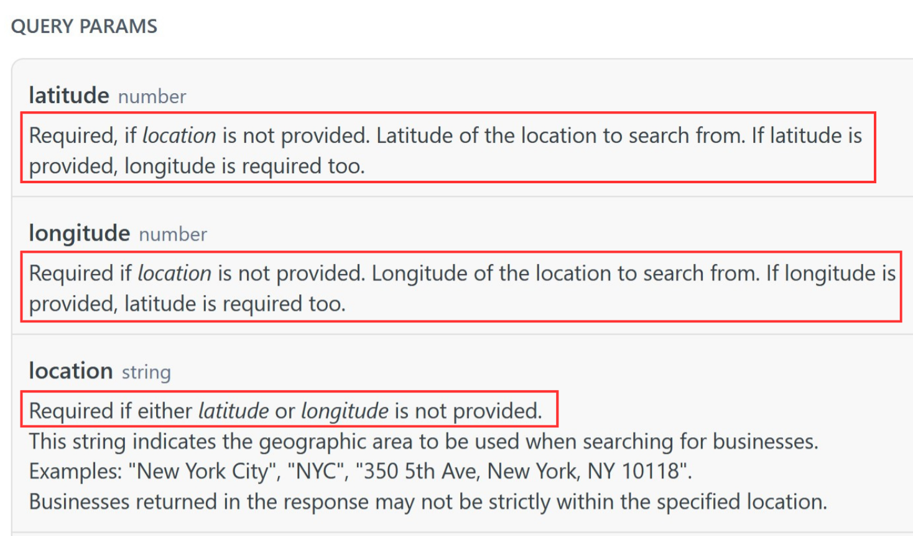

# AISS Workshop / Taller de AISS

* [English](#english)
* [Spanish](#spanish)

## Exercise description

The objective of this exercise is to implement validation code that verifies if the dependencies among input parameters of an API operation are fulfilled. If the dependencies are not met, an error will be returned. You will work on a template project generated from the OpenAPI Specification (OAS) of the Yelp API ("Search Business Transactions" operation). The screenshot below shows a fragment of the API documentation highlighting the dependencies between parameters.

## IDL:
     Or(location, latitude AND longitude);

## Instructions:

- **Step 0:** Clone/download the project and open it in IntelliJ.
- **Step 1:** Open the Java interface “**TransactionsApi**“ located in the package “org.openapitools.api”. Check the code and make sure that you understand it. Ask for clarifications if needed.
- **Step 2:** Make sure you understand the inter-parameter dependencies that you must implement, highlighted in the screenshot shown above. Ask the teacher if you have any questions.
- **Step 3:** Before you start coding, add the start time in the “**Start time**” comment section.
- **Step 4:** Add the validation code for the highlighted dependencies under the “**Add validation code here**” comment section. Each validation block should return a 400 HTTP status code with a simple error message. **Example:** If a document requires that p1 must be greater than p2, then a possible validation code could be as follows:

      if (! (p1 > p2) )
         return new ResponseEntity("p1 must be greater than p2", HttpStatus.BAD_REQUEST);

- **Step 5:** Test your code using a client like Postman or the interactive documentation generated by Swagger (available at http://localhost:8081/swagger-ui/index.html). Remember the application is listening in port 8081.
- **Step 6:** Once you implement and test the validation code for all the dependencies, indicate the end time at the "**End time**" comment section.
- **Step 7:** Save the project as a zip file and submit it through the virtual platform following the instructions provided by the teacher.

## Descripción del ejercicio

El objetivo de este ejercicio es implementar un código de validación que verifique si se cumplen las dependencias entre los parámetros de entrada de una operación de API. Si las dependencias no se cumplen, se devolverá un error. Trabajarás en un proyecto de plantilla generado a partir de la especificación OpenAPI (OAS) de la API de Yelp (operación "Search Business Transactions"). La captura de pantalla a continuación muestra un fragmento de la documentación de la API que destaca las dependencias entre los parámetros.

## IDL:
     Or(location, latitude AND longitude);

## Instrucciones:

- **Paso 0:** Clona/descarga el proyecto y ábrelo en IntelliJ.
- **Paso 1:** Abre la interfaz de Java “**TransactionsApi**“ ubicada en el paquete "org.openapitools.api". Revisa el código y asegúrate de entenderlo. Consúltanos si tienes dudas.
- **Paso 2:** Asegúrate de entender las dependencias entre parámetros que debes implementar, se encuentran resaltadas en la captura de pantalla mostrada anteriormente. Pregunta al profesor si tienes alguna duda.
- **Paso 3:** Antes de comenzar a implementar, añade la hora de inicio en la sección de comentarios “**Start time**”.
- **Paso 4:** Incluye el código de validación para las dependencias resaltadas en la sección de comentarios “**Add validation code here**”. Cada bloque de validación debe devolver un código HTTP 400 con un mensaje de error simple. **Example:** Si un documento requiere que p1 debe ser mayor que p2, entonces un posible código de validación podría ser el siguiente:

     if (! (p1 > p2) )
         return new ResponseEntity("p1 debe ser mayor que p2", HttpStatus.BAD_REQUEST);
                
- **Paso 5:** Prueba tu código usando un cliente como Postman o la documentación interactiva generada por Swagger (disponible en http://localhost:8081/swagger-ui/index.html). Recuerda que la aplicación está funcionando en el puerto 8081.
- **Paso 6:** Una vez que implementes y pruebes el código de validación para todas las dependencias, indica la hora de finalización en la sección de comentarios "**End time**".
- **Paso 7:** Guarda el proyecto como un archivo zip y envíalo a través de la plataforma virtual siguiendo las instrucciones proporcionadas por el profesor.         
 
